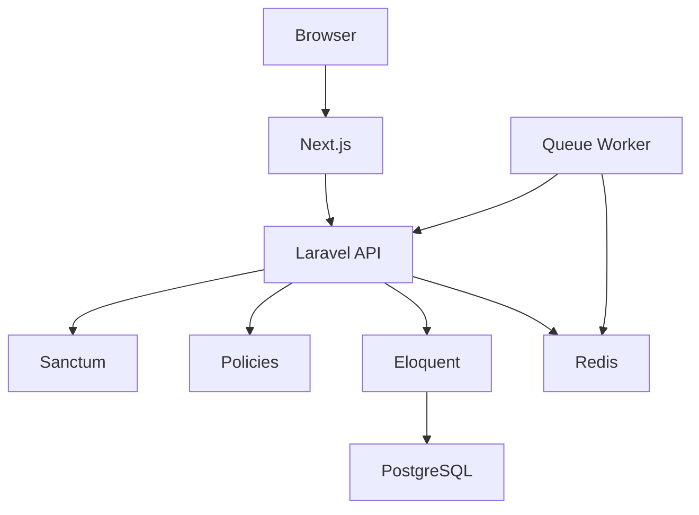

# Astera Solis

Astera Solis e uma aplicacao full stack para gestao de conteudos educacionais
de uma editora. A plataforma organiza escolas, usuarios, colecoes didaticas,
materiais digitais, quizzes e tentativas de estudantes.

O projeto foi construido como monorepo, com API Laravel, frontend Next.js,
PostgreSQL, Redis, Docker, CI/CD e deploy em VPS.

## Stack

### Backend

- PHP 8.3+
- Laravel 13
- Laravel Sanctum
- PostgreSQL
- Redis
- Eloquent ORM
- Form Requests
- API Resources
- Policies
- PHPUnit
- Laravel Pint

### Frontend

- Next.js 16
- React 19
- TypeScript
- Tailwind CSS
- Lucide React

### Infraestrutura

- Docker e Docker Compose
- GitHub Actions
- GHCR
- nginx
- certbot
- VPS Linux

## Estrutura

```text
astera-solis-laravel-case/
  astera-solis-api/     # API Laravel
  astera-solis-web/     # Frontend Next.js
  deploy/               # Compose e templates nginx de producao
  scripts/              # Script de deploy em VPS
  docs/                 # Documentacao tecnica em Markdown e PDF
  docker-compose.yml    # PostgreSQL e Redis para desenvolvimento local
```

## Modulos da aplicacao

- Escolas
- Usuarios
- Colecoes didaticas
- Materiais digitais
- Quizzes
- Questoes
- Tentativas de quiz

## Perfis de acesso

```text
admin:
  gerencia todos os recursos

editor:
  cria e edita colecoes, materiais e quizzes

teacher:
  visualiza colecoes, materiais, quizzes e tentativas

student:
  visualiza materiais e responde quizzes
```

## Arquitetura



## Autenticacao

A autenticacao usa Laravel Sanctum no modo SPA stateful:

1. O frontend chama `GET /sanctum/csrf-cookie`.
2. O Laravel envia o cookie `XSRF-TOKEN`.
3. O frontend envia `POST /api/auth/login` com `credentials: "include"`.
4. O Laravel cria a sessao.
5. O browser guarda o cookie HttpOnly.
6. As rotas protegidas usam `auth:sanctum`.

## Executar localmente

### 1. Subir PostgreSQL e Redis

```powershell
cd C:\trabalho\astera-solis-laravel-case
docker compose up -d
```

Servicos locais:

```text
PostgreSQL: localhost:5432
Redis:      localhost:6379
```

### 2. Configurar a API Laravel

```powershell
cd C:\trabalho\astera-solis-laravel-case\astera-solis-api
composer install
copy .env.example .env
php artisan key:generate
php artisan migrate
php artisan db:seed --class=DemoSeeder
php artisan serve
```

API local:

```text
http://localhost:8000
```

### 3. Configurar o frontend Next.js

```powershell
cd C:\trabalho\astera-solis-laravel-case\astera-solis-web
npm install
npm run dev
```

Frontend local:

```text
http://localhost:3000
```

Se precisar, crie `astera-solis-web/.env.local`:

```env
NEXT_PUBLIC_API_URL=http://localhost:8000
```

## Credenciais iniciais

Os seeders criam usuarios para acesso inicial:

```text
admin@astera.test   / password
editor@astera.test  / password
teacher@astera.test / password
student@astera.test / password
```

## Comandos uteis

### Backend

```powershell
cd C:\trabalho\astera-solis-laravel-case\astera-solis-api
php artisan route:list
php artisan test
vendor\bin\pint --test
```

Recriar banco local:

```powershell
php artisan migrate:fresh --seed
```

### Frontend

```powershell
cd C:\trabalho\astera-solis-laravel-case\astera-solis-web
npm run lint
npm run build
```

## Testes e qualidade

O backend possui testes para:

- login com CSRF;
- rota protegida sem sessao;
- logout;
- consulta do usuario autenticado;
- permissoes por perfil;
- criacao de escola, colecao e material;
- envio de tentativa de quiz;
- seed idempotente.

O pipeline do GitHub Actions executa:

- testes Laravel;
- Laravel Pint;
- lint do frontend;
- build do Next.js;
- build e push das imagens Docker;
- deploy na VPS.

## Deploy

O deploy de producao usa:

- imagens Docker publicadas no GHCR;
- `deploy/docker-compose.vps.yml`;
- nginx no host;
- certbot para HTTPS;
- PostgreSQL e Redis no Docker Compose da VPS;
- worker Laravel para fila Redis.

Arquivos principais:

```text
.github/workflows/deploy.yml
deploy/docker-compose.vps.yml
deploy/nginx/reverse-proxy-http.conf
deploy/nginx/reverse-proxy-https.conf
scripts/deploy-docker.sh
```

## Documentacao tecnica

A documentacao completa esta em:

- [docs](docs)
- [PDF tecnico](docs/Astera_Solis_Documentacao_Tecnica.pdf)

Capitulos principais:

- Introducao e contexto
- Visao geral da solucao
- Escopo funcional e modulos
- Arquitetura fullstack
- Autenticacao com Sanctum
- Modelagem de dados
- Backend Laravel
- Frontend Next.js
- Seguranca, validacao e permissoes
- Deploy, CI/CD e operacao
- Testes, qualidade e checklist
- Execucao local e comandos
- Decisoes tecnicas e tradeoffs
- Glossario tecnico

