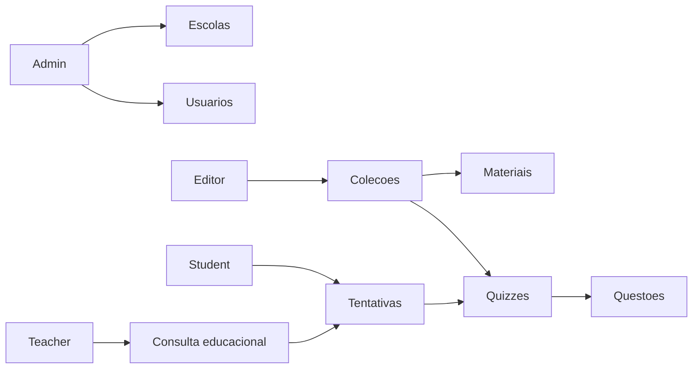

# Escopo Funcional e Modulos

## Objetivo deste capitulo

Este capitulo descreve os modulos funcionais do Astera Solis e como cada parte
da aplicacao participa do fluxo educacional.

## Gestao de usuarios

A aplicacao trabalha com quatro perfis:

- `admin`;
- `editor`;
- `teacher`;
- `student`.

Cada usuario possui nome, email, senha, role e, quando aplicavel, vinculo com
uma escola.

## Gestao de escolas

O modulo de escolas registra instituicoes atendidas pela plataforma. Cada
escola possui nome, cidade, estado, codigo INEP opcional e status ativo.

Esse modulo serve como base para organizar professores e estudantes.

## Gestao de colecoes

Colecoes representam linhas didaticas da editora. Cada colecao possui:

- titulo;
- slug;
- descricao;
- segmento;
- disciplina;
- status.

Colecoes agrupam materiais e quizzes.

## Gestao de materiais

Materiais representam conteudos digitais associados a uma colecao.

Tipos previstos:

- ebook;
- video;
- quiz;
- PDF;
- game.

Cada material possui titulo, resumo, URL, tempo estimado e status.

## Gestao de quizzes

Quizzes representam avaliacoes ou simulados. Cada quiz pertence a uma colecao e
possui titulo, descricao, nota minima e status.

As perguntas do quiz guardam:

- enunciado;
- alternativas em JSON;
- alternativa correta;
- pontuacao.

## Tentativas de quiz

Estudantes podem enviar respostas para um quiz. A API calcula a pontuacao,
define aprovacao e registra a tentativa.

Cada tentativa guarda:

- usuario;
- quiz;
- respostas enviadas;
- nota calculada;
- status de aprovacao;
- data de envio.

## Fluxo funcional resumido

## Regras funcionais principais

- admin gerencia todos os recursos;
- editor gerencia colecoes, materiais e quizzes;
- teacher consulta conteudos e tentativas;
- student consulta materiais e responde quizzes;
- rotas de dominio exigem autenticacao;
- alteracoes de dados passam por validacao e autorizacao no backend.

