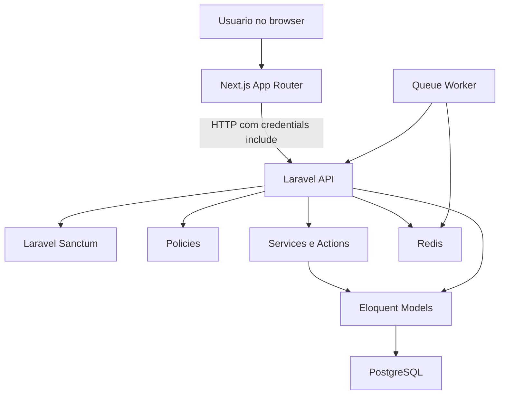
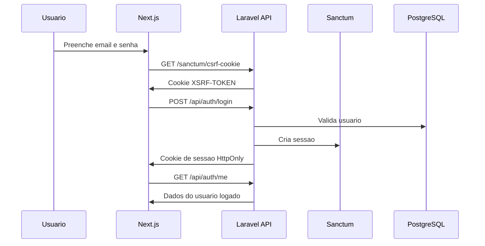
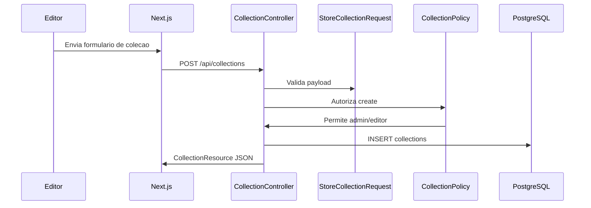
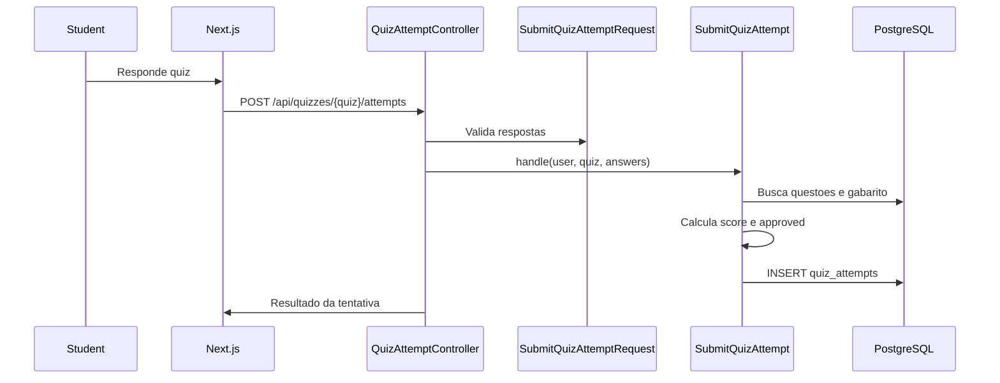
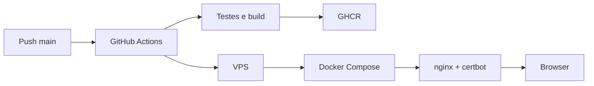

# Arquitetura Fullstack

## Visao geral

## Separacao de responsabilidades

### Frontend

O frontend se concentra em:

- autenticar o usuario;
- renderizar telas;
- enviar formularios;
- mostrar estados de carregamento, erro e sucesso;
- respeitar permissoes vindas do usuario logado.

### Backend

O backend se concentra em:

- autenticar sessoes;
- validar dados;
- autorizar acoes por perfil;
- persistir e consultar dados;
- calcular pontuacao de quizzes;
- expor JSON para o frontend.

### Banco

O PostgreSQL guarda os dados relacionais. Redis fica reservado para cache e
fila, principalmente no ambiente Docker/VPS.

## Fluxo de autenticacao

## Fluxo de criacao de colecao

## Fluxo de tentativa de quiz

## Deploy em alto nivel

