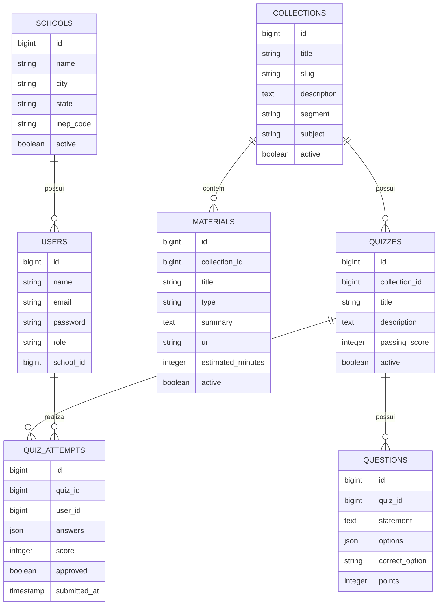

# Modelagem de Dados

## Entidades



## Decisoes de modelagem

### Role como string

O campo `role` usa string em vez de enum nativo do PostgreSQL. Essa escolha
facilita migrations, testes e alteracoes futuras nos perfis de acesso.

### JSON em questions.options

As alternativas ficam em JSON para manter o quiz simples:

```json
{
  "A": "Resposta A",
  "B": "Resposta B",
  "C": "Resposta C",
  "D": "Resposta D"
}
```

### JSON em quiz_attempts.answers

As respostas do estudante tambem ficam em JSON, mapeando `question_id` para
opcao marcada.

### seed_runs

A tabela `seed_runs` registra se o seed inicial ja foi executado no ambiente.
Isso permite popular o banco automaticamente no primeiro deploy sem duplicar
dados nos deploys seguintes.

## Relacionamentos Eloquent

Principais relacionamentos:

- `User belongsTo School`;
- `User hasMany QuizAttempt`;
- `School hasMany User`;
- `Collection hasMany Material`;
- `Collection hasMany Quiz`;
- `Material belongsTo Collection`;
- `Quiz belongsTo Collection`;
- `Quiz hasMany Question`;
- `Quiz hasMany QuizAttempt`;
- `Question belongsTo Quiz`;
- `QuizAttempt belongsTo Quiz`;
- `QuizAttempt belongsTo User`.

## Casts importantes

```php
// Question
'options' => 'array'

// QuizAttempt
'answers' => 'array'
'submitted_at' => 'datetime'
'approved' => 'boolean'
```
