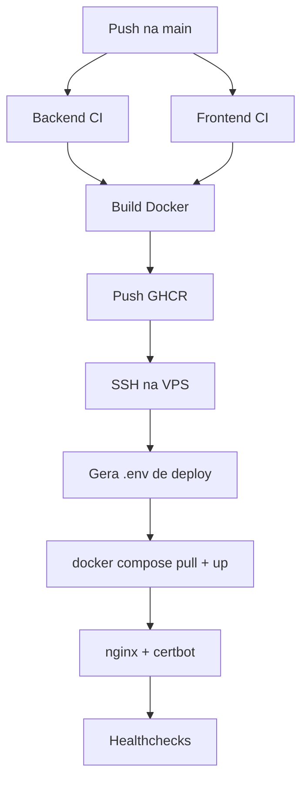

# Deploy, CI/CD e Operacao

## Objetivo

Este capitulo descreve o deploy em VPS com Docker, GitHub Actions, GHCR, nginx
e certbot.

## Pipeline



## CI backend

O job Laravel executa:

```bash
composer install --no-interaction --prefer-dist
cp .env.example .env
php artisan key:generate --ansi
php artisan test
vendor/bin/pint --test
```

## CI frontend

O job Next.js executa:

```bash
npm ci
npm run lint
npm run build
```

## Imagens

As imagens publicadas no GHCR seguem o formato:

```text
ghcr.io/cledson96/astera-solis-laravel-case-api:<sha>
ghcr.io/cledson96/astera-solis-laravel-case-web:<sha>
```

Tambem existe tag `latest`.

## Compose de producao

Servicos:

- `api`;
- `web`;
- `db`;
- `redis`;
- `worker`.

O banco e o Redis nao ficam expostos publicamente. API e web sao publicados
apenas em `127.0.0.1`, e o nginx do host faz o proxy para os dominios.

## Seed inicial em deploy

O deploy define:

```env
RUN_MIGRATIONS_ON_DEPLOY=true
RUN_SEED_ON_DEPLOY=true
```

No primeiro deploy, a API roda migrations e `app:seed-once`. O comando grava
uma linha em `seed_runs`. Nos proximos deploys, ele detecta que ja executou e
nao duplica os dados iniciais.

## Secrets obrigatorios

```text
VPS_HOST
VPS_USER
VPS_SSH_KEY
APP_KEY
POSTGRES_PASSWORD
```

## Vars obrigatorias

```text
FRONTEND_DOMAIN
API_DOMAIN
SESSION_DOMAIN
```

## Vars com defaults

```text
DEPLOY_PATH=/opt/astera-solis
COMPOSE_PROJECT_NAME=astera-solis-production
FRONTEND_PORT=3000
API_PORT=8000
POSTGRES_DB=astera_solis
POSTGRES_USER=astera
```

## Operacao na VPS

Comandos uteis:

```bash
cd /opt/astera-solis
docker compose -f deploy/docker-compose.vps.yml ps
docker compose -f deploy/docker-compose.vps.yml logs -f api
docker compose -f deploy/docker-compose.vps.yml logs -f web
docker compose -f deploy/docker-compose.vps.yml logs -f worker
sudo nginx -t
sudo systemctl reload nginx
sudo certbot certificates
```
